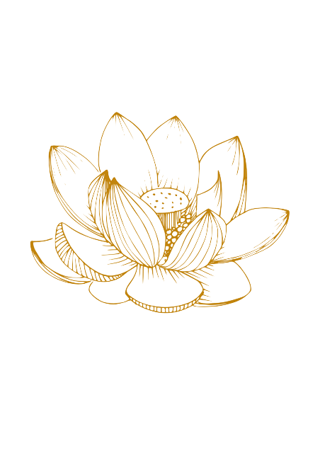

# Services Grid Redesign Implementation Plan

## Overview
Transform the current mixed services grid (services + decorative images) into a clean 4×2 grid with only service cards, and enhance the hero section with a decorative image.

## Current State
- **Services Grid**: 8 service cards mixed with 4 decorative items in 3-column layout
- **Service Cards**: Each contains individual images (massagethai.jpg, massagehuile.jpg, etc.)
- **Hero Section**: Centered layout with logo, text, and CTA button

## Target Layout

### Services Grid (4×2 Layout)
**Row 1:**
- Thai Massage (€65)
- Massage aux huiles (€70) 
- Soins énergétiques (€75)
- Massage des pieds (€60)

**Row 2:**
- Tok Sen (€80)
- Hot herbals (€85)
- Amatarot (€90)
- Massage Abdominal (€95)

**Responsive Behavior:**
- **Desktop (1200px+)**: 4 columns
- **Tablet (768px-1199px)**: 2 columns
- **Mobile (<768px)**: 1 column

### Hero Section Enhancement
- **Left Side**: Logo + title + subtitle + CTA (existing)
- **Right Side**: `images/selected/2.png` as decorative element

---

## Implementation Steps

### Step 1: Transform Services Section

#### 1.1 Remove All Decorative Items
Remove these entire `<div class="grid-item decorative-item">` blocks:
- Line ~166-170: `images/selected/1.png`
- Line ~173-177: `images/selected/2.png` 
- Line ~232-236: `images/selected/7.png`
- Line ~239-243: `images/selected/body.svg`

#### 1.2 Remove Images from Service Cards
From each service card, remove the `` tag:
- **Thai Massage**: Remove ``
- **Massage aux huiles**: Remove ``
- **Soins énergétiques**: Remove ``
- **Massage des pieds**: Remove ``
- **Tok Sen**: Remove ``
- **Hot herbals**: Remove ``
- **Amatarot**: Remove ``
- **Massage Abdominal**: Remove ``

#### 1.3 Reorder Service Cards
Arrange the 8 service cards in this exact order:
1. Thai Massage
2. Massage aux huiles
3. Soins énergétiques
4. Massage des pieds
5. Tok Sen
6. Hot herbals
7. Amatarot
8. Massage Abdominal

### Step 2: Update CSS for 4×2 Grid

#### 2.1 Services Grid Layout
Update `.services-grid` in `css/style.css`:
```css
.services-grid {
  display: grid;
  grid-template-columns: repeat(4, 1fr);
  grid-gap: 2rem;
  max-width: 1200px;
  margin: 0 auto;
}
```

#### 2.2 Responsive Breakpoints
```css
/* Tablet - 2 columns */
@media (max-width: 1199px) {
  .services-grid {
    grid-template-columns: repeat(2, 1fr);
    grid-gap: 1.5rem;
  }
}

/* Mobile - 1 column */
@media (max-width: 767px) {
  .services-grid {
    grid-template-columns: 1fr;
    grid-gap: 1rem;
  }
}
```

#### 2.3 Service Card Enhancements
Optimize service cards for text-only layout:
```css
.service-card {
  padding: 2rem 1.5rem;
  text-align: center;
  border-radius: 15px;
  box-shadow: 0 5px 20px rgba(0, 0, 0, 0.08);
  transition: transform 0.3s ease, box-shadow 0.3s ease;
  background: white;
  height: 100%; /* Ensure equal heights */
}

.service-card:hover {
  transform: translateY(-8px);
  box-shadow: 0 15px 40px rgba(0, 0, 0, 0.15);
}

.service-card h3 {
  font-size: 1.4rem;
  margin-bottom: 1rem;
  color: #333;
}

.service-price {
  font-size: 1.2rem;
  font-weight: 600;
  margin-bottom: 1rem;
}

.service-card p {
  font-size: 0.95rem;
  line-height: 1.6;
  color: #666;
  margin-bottom: 1rem;
}

.service-benefits {
  font-size: 0.85rem;
  color: #888;
  margin-bottom: 1.5rem;
}
```

### Step 3: Enhance Hero Section

#### 3.1 HTML Structure
Update the hero section in `index.html` (lines ~111-130):

**Replace:**
```html
<div class="row align-items-center justify-content-center text-center">
  <div class="col-md-8 text-center">
    
    <div class="hero-text">
      <h1 class="text-black hero-title">La voie vers votre bien-être</h1>
      <p class="lead text-black mb-5 hero-subtitle">Thérapies alternatives & préventives</p>
      <a href="#services" class="btn btn-primary btn-booking-cta hero-cta" aria-label="Voir nos services">
        <span>Voir nos services</span>
        <i class="icon-arrow-down hero-arrow" aria-hidden="true"></i>
      </a>
    </div>
  </div>
</div>
```

**With:**
```html
<div class="row align-items-center">
  <!-- Left Column: Content -->
  <div class="col-lg-8 col-md-7 text-center text-md-left">
    
    <div class="hero-text">
      <h1 class="text-black hero-title">La voie vers votre bien-être</h1>
      <p class="lead text-black mb-5 hero-subtitle">Thérapies alternatives & préventives</p>
      <a href="#services" class="btn btn-primary btn-booking-cta hero-cta" aria-label="Voir nos services">
        <span>Voir nos services</span>
        <i class="icon-arrow-down hero-arrow" aria-hidden="true"></i>
      </a>
    </div>
  </div>
  
  <!-- Right Column: Decorative Image -->
  <div class="col-lg-4 col-md-5 d-none d-md-block text-center">
    <div class="hero-decorative">
      
    </div>
  </div>
</div>
```

#### 3.2 Hero CSS Enhancements
Add to `css/style.css`:
```css
.hero-decorative {
  padding: 2rem 0;
}

.hero-decorative-image {
  max-width: 300px;
  opacity: 0.9;
  filter: drop-shadow(0 10px 30px rgba(0, 0, 0, 0.1));
  animation: float 6s ease-in-out infinite;
}

@keyframes float {
  0%, 100% { transform: translateY(0px); }
  50% { transform: translateY(-10px); }
}

/* Responsive hero adjustments */
@media (max-width: 991px) {
  .hero-decorative {
    padding: 1rem 0;
    margin-top: 2rem;
  }
  
  .hero-decorative-image {
    max-width: 200px;
  }
}

@media (max-width: 767px) {
  .hero-decorative {
    display: none !important;
  }
}
```

---

## File Locations

### Files to Modify:
1. **`index.html`**: 
   - Services section (lines ~132-272)
   - Hero section (lines ~111-130)

2. **`css/style.css`**:
   - Services grid styles (around line ~504)
   - Responsive breakpoints (around line ~631)
   - Add hero decorative styles

### Images Used:
- **Remove from service cards**: All individual service images
- **Add to hero**: `images/selected/2.png`

---

## Expected Results

### Benefits:
✅ **Clean service overview** - All 8 services visible at once  
✅ **Better mobile experience** - Text-based cards stack nicely  
✅ **Faster loading** - Fewer images to load  
✅ **Enhanced hero appeal** - Decorative element adds visual interest  
✅ **Improved accessibility** - Cleaner content structure  
✅ **Better responsive design** - Optimized for all screen sizes  

### Visual Layout:
- **Desktop**: 4×2 services grid + split hero with decorative image
- **Tablet**: 2×4 services grid + split hero with smaller image  
- **Mobile**: 1×8 services stack + hero content only (image hidden)

---

## Testing Checklist

After implementation, verify:
- [ ] All 8 services display correctly in 4×2 grid on desktop
- [ ] Grid becomes 2×4 on tablet screens
- [ ] Grid becomes 1×8 on mobile screens
- [ ] Hero image appears on right side on desktop/tablet
- [ ] Hero image is hidden on mobile
- [ ] All service card content is readable and properly styled
- [ ] Hover effects work on service cards
- [ ] Page loads faster without individual service images